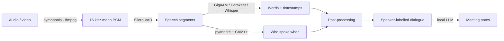

<div align="center">

<a href="README.md">Русский</a> · <a href="README.en.md"><b>English</b></a>


<h3>Transcription, speakers, and meeting notes — 100% offline, on any PC</h3>

<p>
A desktop app that turns any audio or video into a clean, speaker-labelled transcript,
then — with a local LLM — into a summary, protocol, or to-do list. Everything runs on
your machine: not a single byte of the recording ever leaves it.
</p>

<p>
<a href="../../releases/latest"></a>
<a href="../../actions/workflows/ci.yml"></a>


</p>

</div>

---

## Table of contents

[Features](#-features) ·
[Screenshots](#-screenshots) ·
[How it works](#️-how-it-works) ·
[Models](#-models) ·
[Performance](#-performance) ·
[Install](#-install) ·
[Tech stack](#-tech-stack) ·
[Roadmap](#️-roadmap) ·
[License](#-license)

## ✨ Features

| | |
|---|---|
| 🔒 **Fully offline** | Transcription, diarization, and AI notes run locally. Audio never leaves the machine — ideal for interviews, negotiations, and medical/legal/HR recordings. |
| 🗣️ **Who spoke when** | Speech is split by speaker automatically: “Speaker 1 [00:14]: …”. Set the exact speaker count or let it auto-detect. |
| 📝 **Meeting notes** | A local LLM turns the transcript into a summary, business protocol, interview digest, or to-do list — with interactive checkboxes. |
| 💻 **Runs on weak hardware** | CPU-first: even on a single core it's ~7× faster than real time (~17 min per hour of audio), peak RAM < 1 GB. No GPU required. |
| 🌍 **Model & language choice** | Russian by default (GigaAM v3), plus multilingual Parakeet (25 languages) and Whisper (98 languages) — switchable in settings. |
| 🎧 **Karaoke-highlight player** | A built-in audio/video player highlights the active line; click a line to seek to it. |
| ✏️ **Speaker renaming** | “Speaker 1” → “John”: names persist and are even injected into LLM prompts, so the protocol says “John”, not “Speaker 2”. |
| 📄 **Export TXT / MD / PDF** | Export transcripts and notes; PDF is generated natively with an embedded Cyrillic-capable font. |
| 🕘 **Recording history** | Results are stored in a local SQLite database and restored on the next launch. Auto-title from the meeting content. |
| ⚡ **GPU acceleration for notes** | A discrete Vulkan GPU (≥ 4 GB VRAM) speeds the LLM up ~10× automatically; on an iGPU / without Vulkan it silently falls back to CPU. |
| 📥 **Honest auto-download** | A first-run wizard and background downloads with real sizes shown in the UI; small models are embedded in the installer. |
| 🖱️ **Drag & drop, cancel, ETA** | File drag-and-drop, a Stop button, self-calibrating time estimates, and a live status bar with CPU/RAM load. |
| 🎙️ **Dictation (push-to-talk)** | A global hotkey (even a single key — e.g. right Shift): hold → speak, release → text is recognized locally, copied to the clipboard and pasted at the cursor in any app. History of quick recognitions on its own tab. |
| 🔌 **Local MCP server** | A built-in Model Context Protocol server on `127.0.0.1`: any AI/code agent (Claude Code, Cursor, VS Code, Codex) can drive the engine — transcribe files, diarize, make protocols, browse history. One-click add-to-client buttons. |
| 🖥️ **Tray + background** | Minimizes to the tray (system-style icon); closing the window doesn't stop processing or the MCP server. |
| ⬆️ **Auto-update** | About → "Check": the app finds a newer GitHub release, downloads and installs it seamlessly (signed updates). |

## 🎬 Screenshots

> _UI screenshots will be added here._ For now, the brand banner above and the pipeline diagram below.

<!-- Ready-to-fill markup — drop PNGs into assets/:
<p align="center">
  
  
</p>
-->

## ⚙️ How it works

One native C++/ONNX pipeline, entirely on your machine:



1. **Decode** — audio/video is decoded to 16 kHz mono PCM: natively via `symphonia`, with an `ffmpeg` fallback for webm/opus and anything symphonia can't handle.
2. **Speech chunking (VAD)** — Silero VAD cuts long files into segments (≤ 20 s) so boundaries land in silence, never mid-word.
3. **Recognition (ASR)** — each segment goes through sherpa-onnx (GigaAM CTC / Parakeet / Whisper) → words with timestamps; GigaAM v3 emits punctuation and casing directly.
4. **Diarization** — pyannote-segmentation + a CAM++ embedder determine “who spoke when” (clustering threshold, or an exact speaker count from the UI).
5. **Post-processing** — words are assigned to speakers by maximum overlap, islands are smoothed, and adjacent turns are merged → “Speaker N [timestamp]: text”.
6. **Meeting notes** (optional) — the transcript goes to a local LLM via `llama-server` → summary / protocol / to-dos. Long recordings use map-reduce with a cached digest, so a second artifact for the same meeting is ~9× cheaper.

## 🧠 Models

The language model is chosen in settings; infra models for diarization download in the
background. Everything is **downloaded on first run** and is not part of this repository.

| Model | Role | Size | License |
|---|---|---:|---|
| **GigaAM v3 CTC-punct** | ASR — Russian (default), punctuation + word timestamps | ~160 MB | ⚠️ Noncommercial |
| **Parakeet-TDT-0.6b-v3** | ASR — 25 languages, fastest | ~640 MB | CC-BY-4.0 |
| **Whisper small** | ASR — 98 languages | ~466 MB | MIT |
| **Qwen3-4B-Instruct-2507** (Q4_K_M) | LLM notes — best quality | ~2.4 GB | Apache-2.0 |
| **Qwen3-1.7B** (Q4_K_M) | LLM notes — for weak PCs | ~1.1 GB | Apache-2.0 |
| pyannote-segmentation-3.0 | Diarization — speech segmentation | ~6 MB | MIT |
| CAM++ (3D-Speaker) | Diarization — voice embedding | ~28 MB | Apache-2.0 |
| Silero VAD | Voice activity detection | ~2 MB | MIT |

> ⚠️ The default **GigaAM** model is under a noncommercial license. Full component
> licensing is in [`NOTICE.md`](NOTICE.md).

## 📊 Performance

CPU measurements (Phase 0 and real meetings). A GPU only helps the notes — it does not speed up ASR.

| Metric | Value |
|---|---|
| GigaAM (Russian), CPU | **×15.9** faster than real time |
| Parakeet-v3, CPU | ×24 |
| Whisper-small, CPU | ×2.7 |
| Diarization, CPU | ×14 |
| ASR + diarization, 1 hour of audio | ~8–9 min (multi-core CPU) |
| Even on 1 core | ×7 (~17 min per hour) |
| Peak RAM | **< 1 GB**, does not grow with length |
| Installer / release exe | ~8 MB / ~32 MB |
| Notes on CPU (warm server) | summary ~33 s |
| Notes on GPU (Vulkan, RTX 3090 Ti) | ~169 tok/s — roughly ×10 over CPU |

## 🚀 Install

### Prebuilt installer

Download the latest installer from [**Releases**](../../releases):
- **macOS Apple Silicon (M1+)** — `*_aarch64.dmg`;
- **macOS Intel** — `*_x64.dmg`;
- **Windows 10/11** — `*-setup.exe` (NSIS).

An installed app **updates itself**: About → "Check" (or a silent check when the page opens)
finds a new GitHub release and installs it seamlessly.

> **First launch** (the app isn't code-signed with a paid Apple/Microsoft certificate yet):
> - **macOS** — drag it to Applications, then **right-click the app → "Open"** → "Open".
>   If macOS says it's "damaged", clear the quarantine once:
>   `xattr -cr /Applications/SpeakAgent.app`
> - **Windows** — on the SmartScreen prompt click "More info" → "Run anyway".
>
> After that the app updates itself — no more warnings.

### Build from source

**Requires:** [Rust](https://rustup.rs/) (`stable-x86_64-pc-windows-msvc`) + **MSVC C++
Build Tools** (linker + Windows SDK) + [Node 20](https://nodejs.org/) and
[pnpm](https://pnpm.io/). FFmpeg is downloaded automatically — no system install needed.

```bash
pnpm install
pnpm tauri dev                       # run the app (Vite + native window)
pnpm tauri build --bundles nsis      # installer → src-tauri/target/release/bundle/nsis/*.exe
```

MSVC Build Tools (if missing, from an elevated terminal):

```powershell
winget install --id Microsoft.VisualStudio.2022.BuildTools --override "--quiet --wait --add Microsoft.VisualStudio.Workload.VCTools --includeRecommended"
```

**Quick headless engine test** (verify the Rust core without a GUI):

```bash
cd src-tauri
cargo run --example try_transcribe -- "<file>" [secs] [diarize]
cargo run --example try_llm -- gen <transcript.txt> [summary|business|interview|todo]
```

## 🛠 Tech stack

- **Shell:** Tauri 2 (Rust core + system WebView). ~8 MB installer; ~32 MB release exe with sherpa-onnx + ONNX Runtime statically linked — no side DLLs.
- **Frontend:** React 19 · Vite 7 · Tailwind 4 · Zustand · TanStack Query · react-router. Dark zinc + amber theme, glass/vibrancy.
- **Engine:** [sherpa-onnx](https://github.com/k2-fsa/sherpa-onnx) 1.13.4 (official Rust crate, prebuilt binaries — no C++ build). ASR + diarization + Silero VAD.
- **Local LLM:** `llama-server` (llama.cpp) as a sidecar, downloaded at runtime like ffmpeg; Vulkan build (GPU + CPU in one archive); OpenAI-compatible HTTP over `ureq` with streaming.
- **Decode:** `symphonia` (pure Rust) → `ffmpeg` fallback. **Storage:** SQLite (`rusqlite`). **PDF:** `genpdf` + embedded DejaVu.

## 🗺️ Roadmap

| Phase | Scope | Status |
|---|---|---|
| 0 | Validate the core (sherpa-onnx) on real files | ✅ Done |
| 1 | Windows MVP: transcription + diarization, models, export, history, player | ✅ Done |
| 3 | Meeting notes — protocols/summaries/to-dos via a local LLM | ✅ Done |
| 2 | macOS (Intel + Apple Silicon) + Metal: `.app`/`.dmg`, vibrancy | ✅ Done |
| — | Dictation (push-to-talk), local MCP server, tray | ✅ Done |
| — | Auto-update (GitHub Releases, signed updates) | ✅ Done |
| 4 | Monetization / licensing, code signing (Gatekeeper/SmartScreen) | ⬜ Planned |
| 5+ | Folder watch, subtitle editor, glossary, i18n, live streaming | ⬜ Planned |

See [`CHANGELOG.md`](CHANGELOG.md) for the full history.

## 📄 License

The code is licensed under [**PolyForm Noncommercial 1.0.0**](LICENSE.md): free to study,
modify, and use for **noncommercial** purposes. Third-party components and models keep
their own licenses — notably, **the default Russian GigaAM model is noncommercial**.
The full list is in [`NOTICE.md`](NOTICE.md).

## 🙏 Acknowledgements

This project stands on the shoulders of open components:
[sherpa-onnx](https://github.com/k2-fsa/sherpa-onnx),
[llama.cpp](https://github.com/ggml-org/llama.cpp),
[GigaAM](https://github.com/salute-developers/GigaAM),
[Whisper](https://github.com/openai/whisper),
[NVIDIA NeMo Parakeet](https://huggingface.co/nvidia/parakeet-tdt-0.6b-v3),
[pyannote](https://github.com/pyannote/pyannote-audio),
[Silero VAD](https://github.com/snakers4/silero-vad),
[Tauri](https://github.com/tauri-apps/tauri) — thanks to their authors.

<div align="center">
<sub>Made with ❤️ for people who value the privacy of their recordings.</sub>
</div>
