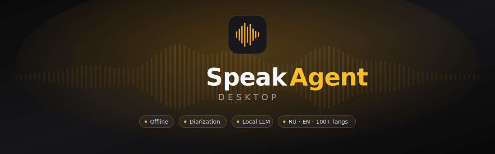
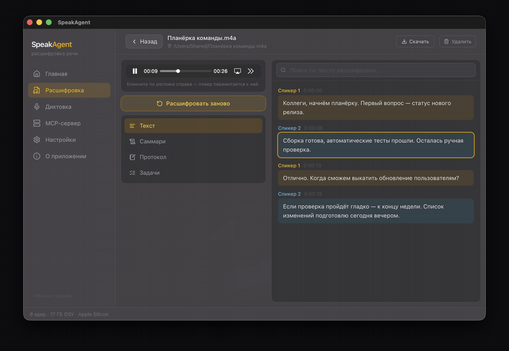
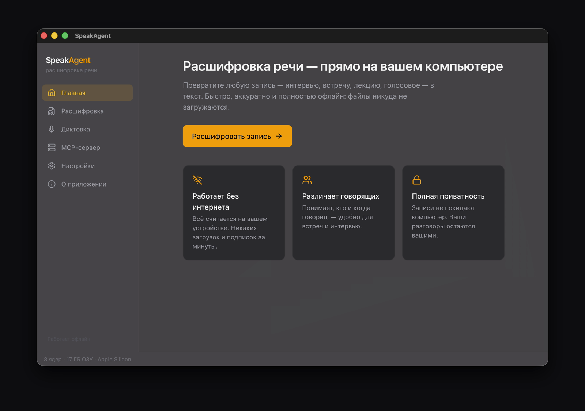
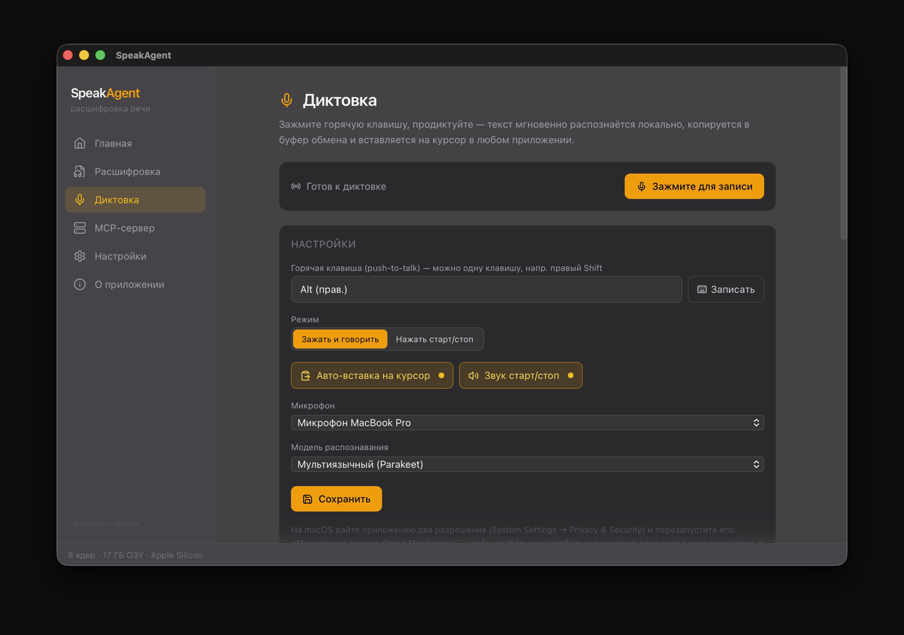
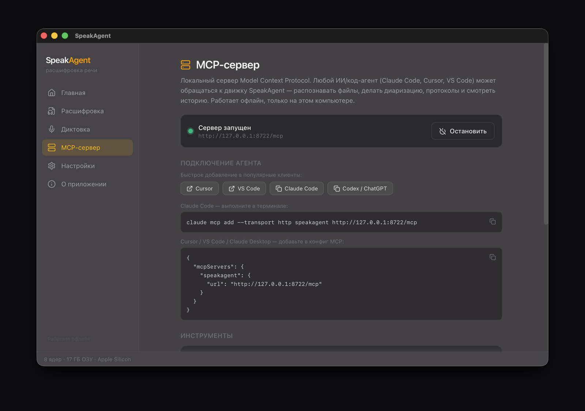
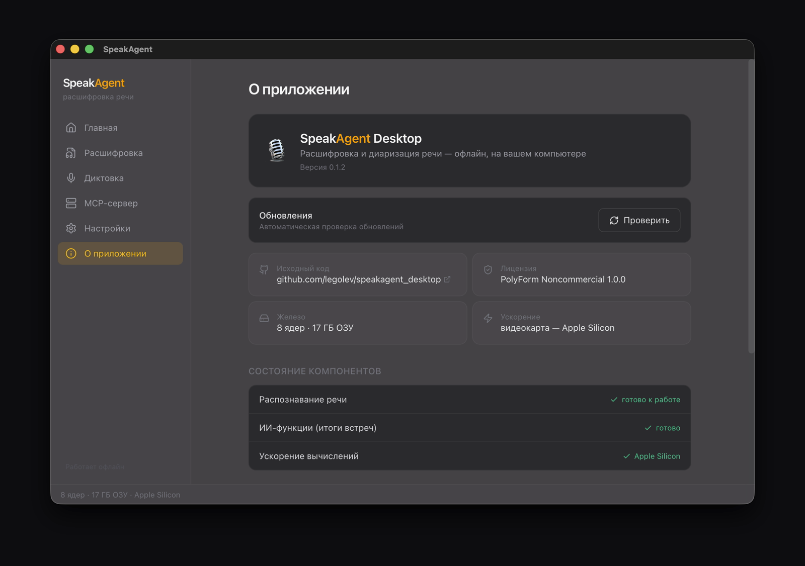
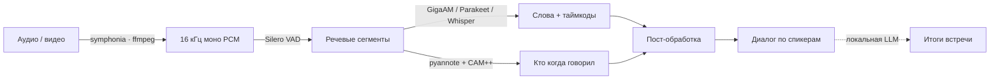

<div align="center">

<a href="README.md"><b>Русский</b></a> · <a href="README.en.md">English</a>



<h3>Расшифровка, разбивка по спикерам и «Итоги встречи» — полностью офлайн, на любом ПК</h3>

<p>
Настольное приложение, которое превращает любое аудио или видео в аккуратную расшифровку
с разбивкой по спикерам, а затем — силами локальной LLM — в саммари, протокол или список
задач. Всё работает на вашем компьютере: ни один байт записи не уходит в сеть.
</p>

<p>
<a href="../../releases/latest"></a>
<a href="../../actions/workflows/ci.yml"></a>


</p>

</div>

---

## Оглавление

[Возможности](#-возможности) ·
[Скриншоты](#-скриншоты) ·
[Как это работает](#-как-это-работает) ·
[Модели](#-модели) ·
[Производительность](#-производительность) ·
[Установка](#-установка) ·
[Технологии](#-технологии) ·
[Дорожная карта](#-дорожная-карта) ·
[Лицензия](#-лицензия)

## ✨ Возможности

| | |
|---|---|
| 🔒 **Полностью офлайн** | Транскрипция, диаризация и ИИ-итоги работают локально. Аудио никогда не покидает компьютер — особенно для интервью, переговоров, а также медицинских, юридических и кадровых записей. |
| 🗣️ **Кто когда говорил** | Речь автоматически разбивается по спикерам: «Спикер 1 [00:14]: …». Можно указать точное число говорящих или довериться авто-определению. |
| 📝 **«Итоги встречи»** | Локальная LLM превращает расшифровку в саммари, деловой протокол, конспект собеседования или список задач — с интерактивными чек-боксами. |
| 💻 **Работает на слабом железе** | CPU-first: даже на одном ядре ~×7 быстрее реального времени (~17 мин на час записи), пик RAM < 1 ГБ. GPU не обязателен. |
| 🌍 **Выбор модели и языка** | Русский по умолчанию (GigaAM v3), плюс мультиязычные Parakeet (25 языков) и Whisper — от small до large-v3 turbo (99 языков) — переключаются в настройках. |
| 🎧 **Плеер с караоке-подсветкой** | Встроенный аудио/видео-плеер подсвечивает активную реплику; клик по строке перематывает к нужному месту. |
| ✏️ **Переименование спикеров** | «Спикер 1» → «Иван»: имена сохраняются и подставляются даже в промпты LLM, поэтому протокол пишет «Иван», а не «Speaker 2». |
| 📄 **Экспорт TXT / MD / PDF** | Выгрузка расшифровки и итогов; PDF генерируется нативно со встроенным кириллическим шрифтом. |
| 🕘 **История записей** | Все результаты хранятся в локальной SQLite-базе и восстанавливаются при следующем запуске. Авто-заголовок по содержанию встречи. |
| ⚡ **GPU-ускорение для итогов** | Дискретная карта с Vulkan (≥ 4 ГБ VRAM) автоматически ускоряет LLM ~в 10×; на iGPU/без Vulkan тихо работает на CPU. |
| 📥 **Честная авто-загрузка** | Мастер первого запуска и фоновая докачка моделей с реальными размерами в UI; мелкие модели вшиты в установщик. |
| 🖱️ **Drag & drop, отмена, ETA** | Перетаскивание файлов, кнопка «Стоп», само-калибрующаяся оценка времени, живой статус-бар с загрузкой CPU/RAM. |
| 🎙️ **Диктовка (push-to-talk)** | Глобальная горячая клавиша (даже одиночная — напр. правый Shift): зажали — говорите, отпустили — текст мгновенно распознаётся локально, копируется в буфер и вставляется по месту курсора в любом приложении. История диктовок — отдельной вкладкой. |
| 🔌 **Локальный MCP-сервер** | Встроенный сервер Model Context Protocol на `127.0.0.1`: любой ИИ/код-агент (Claude Code, Cursor, VS Code, Codex) обращается к движку — распознаёт файлы, делает диаризацию, протоколы и смотрит историю. Кнопки быстрого добавления в клиенты. |
| 🖥️ **Трей + фон** | Сворачивается в трей (иконка в стиле системных), закрытие окна не останавливает обработку и MCP-сервер. |
| ⬆️ **Авто-обновление** | «О приложении» → «Проверить»: приложение само находит свежий релиз на GitHub, скачивает и устанавливает его бесшовно (подписанные обновления). |

## 🎬 Скриншоты

<p align="center">
  
</p>
<p align="center"><sub>Расшифровка с разбивкой по спикерам — активная реплика подсвечивается синхронно с плеером, клик по реплике перематывает запись.</sub></p>

<table>
  <tr>
    <td width="50%" align="center"><br><sub>Главная</sub></td>
    <td width="50%" align="center"><br><sub>Диктовка (push-to-talk)</sub></td>
  </tr>
  <tr>
    <td align="center"><br><sub>Локальный MCP-сервер</sub></td>
    <td align="center"><br><sub>О приложении · авто-обновление</sub></td>
  </tr>
</table>

## ⚙ Как это работает

Один нативный C++/ONNX-конвейер, целиком на вашей машине:



1. **Декод** — аудио/видео разбирается в 16 кГц моно PCM: нативно через `symphonia`, с fallback на `ffmpeg` для webm/opus и всего, что symphonia не берёт.
2. **Нарезка по речи (VAD)** — Silero VAD режет длинный файл на сегменты (≤ 20 с) так, чтобы границы падали в тишину, а не посреди слова.
3. **Распознавание (ASR)** — каждый сегмент проходит через sherpa-onnx (GigaAM CTC / Parakeet / Whisper) → слова с таймкодами; GigaAM v3 сразу отдаёт пунктуацию и заглавные.
4. **Диаризация** — pyannote-segmentation + эмбеддер CAM++ определяют, «кто когда говорил» (порог кластеризации или точное число спикеров из UI).
5. **Пост-обработка** — назначение слов спикерам по максимальному перекрытию, сглаживание «островков», склейка соседних реплик → формат «Спикер N [таймкод]: текст».
6. **«Итоги встречи»** (опционально) — расшифровка уходит в локальную LLM через `llama-server` → саммари / протокол / задачи. Длинные записи идут через map-reduce с кэшем дайджеста, поэтому второй артефакт по той же встрече считается в ~9× дешевле.

## 🧠 Модели

Языковую модель выбирают в настройках; служебные модели диаризации тянутся в фоне.
Всё **скачивается при первом запуске** и не входит в репозиторий.

| Модель | Роль | Размер | Лицензия |
|---|---|---:|---|
| **GigaAM v3 CTC-punct** | ASR — русский (по умолчанию), пунктуация + таймкоды слов | ~160 МБ | ⚠️ Некоммерческая |
| **Parakeet-TDT-0.6b-v3** | ASR — 25 языков, самый быстрый | ~640 МБ | CC-BY-4.0 |
| **Whisper small** | ASR — 98 языков | ~466 МБ | MIT |
| **Whisper large-v3 turbo** | ASR — 99 языков, для трудного аудио | ~540 МБ | MIT |
| **Qwen3-4B-Instruct-2507** (Q4_K_M) | LLM «Итоги» — лучшее качество | ~2.4 ГБ | Apache-2.0 |
| **Qwen3-1.7B** (Q4_K_M) | LLM «Итоги» — для слабых ПК | ~1.1 ГБ | Apache-2.0 |
| pyannote-segmentation-3.0 | Диаризация — сегментация речи | ~6 МБ | MIT |
| CAM++ (3D-Speaker) | Диаризация — различение голосов | ~28 МБ | Apache-2.0 |
| Silero VAD | Детектор речи | ~2 МБ | MIT |

> ⚠️ Модель по умолчанию **GigaAM** — под некоммерческой лицензией. Подробности и лицензии
> остальных компонентов — в [`NOTICE.md`](NOTICE.md).

## 📊 Производительность

Замеры на CPU (Фаза 0 и реальные встречи). GPU нужен только для «Итогов» — ASR он не ускоряет.

| Что | Значение |
|---|---|
| GigaAM (русский), CPU | **×15.9** быстрее реального времени |
| Parakeet-v3, CPU | ×24 |
| Whisper-small, CPU | ×2.7 |
| Диаризация, CPU | ×14 |
| ASR + диаризация, 1 час аудио | ~8–9 мин (многоядерный CPU) |
| Даже на 1 ядре | ×7 (~17 мин на час) |
| Пиковая RAM | **< 1 ГБ**, не растёт с длиной записи |
| Установщик / релизный exe | ~8 МБ / ~32 МБ |
| «Итоги» на CPU (тёплый сервер) | саммари ~33 с |
| «Итоги» на GPU (Vulkan, RTX 3090 Ti) | ~169 т/с — примерно ×10 к CPU |

## 🚀 Установка

### Готовый установщик

Скачайте свежий установщик со страницы [**Releases**](../../releases):
- **macOS Apple Silicon (M1+)** — `*_aarch64.dmg`;
- **macOS Intel** — `*_x64.dmg`;
- **Windows 10/11** — `*-setup.exe` (NSIS).

Установленное приложение **обновляется само**: «О приложении» → «Проверить» (или тихая
автопроверка при открытии страницы) находит новый релиз на GitHub и ставит его бесшовно.

> **Первый запуск** (приложение пока без платной подписи разработчика Apple/Microsoft):
> - **macOS** — перетащите в «Программы», затем **правый клик по приложению → «Открыть»** → «Открыть».
>   Если macOS пишет «повреждено», снимите карантин один раз:
>   `xattr -cr /Applications/SpeakAgent.app`
> - **Windows** — в окне SmartScreen нажмите «Подробнее» → «Всё равно выполнить».
>
> Дальше приложение обновляется само — предупреждений больше не будет.

### Сборка из исходников

**Требуется:** [Rust](https://rustup.rs/) (`stable-x86_64-pc-windows-msvc`) + **MSVC C++
Build Tools** (линкер + Windows SDK) + [Node 20](https://nodejs.org/) и
[pnpm](https://pnpm.io/). FFmpeg докачивается сам — системный не нужен.

```bash
pnpm install
pnpm tauri dev                       # запустить приложение (Vite + нативное окно)
pnpm tauri build --bundles nsis      # установщик → src-tauri/target/release/bundle/nsis/*.exe
```

MSVC Build Tools (если ещё нет, из терминала с правами администратора):

```powershell
winget install --id Microsoft.VisualStudio.2022.BuildTools --override "--quiet --wait --add Microsoft.VisualStudio.Workload.VCTools --includeRecommended"
```

**Быстрый тест движка без GUI** (проверить ядро на Rust):

```bash
cd src-tauri
cargo run --example try_transcribe -- "<файл>" [сек] [diarize]
cargo run --example try_llm -- gen <transcript.txt> [summary|business|interview|todo]
```

### Релизы (для мейнтейнеров)

Сборка `.dmg`/`.exe` и публикация в Releases — автоматически через GitHub Actions
([`.github/workflows/release.yml`](.github/workflows/release.yml)):

```bash
# 1) поднять "version" в src-tauri/tauri.conf.json и package.json (напр. 0.1.2)
# 2) закоммитить и запушить тег:
git tag v0.1.2 && git push origin v0.1.2
```

CI соберёт macOS (arm64) и Windows, подпишет артефакты обновления и создаст Release с
установщиками + `latest.json` (по нему работает автообновление).

**Секреты репозитория** (Settings → Secrets → Actions):

_Подпись обновлений_ (Ed25519, `pnpm tauri signer generate`; публичный ключ уже в
`tauri.conf.json → plugins.updater.pubkey`):
- `TAURI_SIGNING_PRIVATE_KEY` — приватный ключ;
- `TAURI_SIGNING_PRIVATE_KEY_PASSWORD` — пароль ключа (пустой, если без пароля).

_Подпись кода macOS_ (самоподписанный сертификат — стабильная «личность», чтобы разрешения
macOS не слетали при обновлениях; CI сам добавляет ему trust):
- `APPLE_CERTIFICATE` — `.p12` в base64;
- `APPLE_CERTIFICATE_PASSWORD` — пароль `.p12`;
- `APPLE_SIGNING_IDENTITY` — Common Name сертификата (напр. `SpeakAgent`);
- `KEYCHAIN_PASSWORD` — любой пароль для временного keychain в CI.

⚠️ Приватные ключи/сертификаты храните в тайне. Без macOS-секретов сборка идёт без подписи
(ad-hoc) — работает, но разрешения будут сбрасываться на каждом обновлении. Для полностью
бесшовного запуска (без предупреждений Gatekeeper) нужен платный Apple Developer ID + нотаризация.

## 🛠 Технологии

- **Оболочка:** Tauri 2 (Rust-ядро + системный WebView). Установщик ~8 МБ; релизный exe ~32 МБ со статически слинкованными sherpa-onnx + ONNX Runtime — без сторонних DLL.
- **Фронтенд:** React 19 · Vite 7 · Tailwind 4 · Zustand · TanStack Query · react-router. Тёмная тема zinc + amber, glass/vibrancy.
- **Движок:** [sherpa-onnx](https://github.com/k2-fsa/sherpa-onnx) 1.13.4 (официальный Rust-крейт, prebuilt-бинарники — без сборки C++). ASR + диаризация + Silero VAD.
- **Локальная LLM:** `llama-server` (llama.cpp) как sidecar, качается в рантайме как ffmpeg; Vulkan-сборка (GPU + CPU в одном архиве); OpenAI-совместимый HTTP через `ureq` со стримингом.
- **Декод:** `symphonia` (чистый Rust) → `ffmpeg` fallback. **Хранилище:** SQLite (`rusqlite`). **PDF:** `genpdf` + встроенный DejaVu.

## 🗺 Дорожная карта

| Фаза | Что | Статус |
|---|---|---|
| 0 | Валидация ядра (sherpa-onnx) на реальных файлах | ✅ Готово |
| 1 | Windows MVP: транскрипция + диаризация, модели, экспорт, история, плеер | ✅ Готово |
| 2 | macOS (Intel + Apple Silicon) + Metal: `.app`/`.dmg`, vibrancy | ✅ Готово |
| 3 | «Итоги встречи» — протоколы/саммари/задачи через локальную LLM | ✅ Готово |
| — | Диктовка (push-to-talk), локальный MCP-сервер, трей | ✅ Готово |
| — | Авто-обновление (GitHub Releases, подписанные обновления) | ✅ Готово |
| 4 | Монетизация / лицензирование, подпись кода (Gatekeeper/SmartScreen) | ⬜ Планы |
| 5+ | Папка-watch, редактор субтитров, глоссарий, i18n, live-стриминг | ⬜ Планы |

Историю изменений см. в [`CHANGELOG.md`](CHANGELOG.md).

## 📄 Лицензия

Код — под лицензией [**PolyForm Noncommercial 1.0.0**](LICENSE.md): свободно изучать,
изменять и использовать в **некоммерческих** целях. Сторонние компоненты и модели —
под своими лицензиями; ключевой момент — **модель русского языка GigaAM некоммерческая**.
Полный список — в [`NOTICE.md`](NOTICE.md).

## 🙏 Благодарности

Проект стоит на плечах открытых компонентов:
[sherpa-onnx](https://github.com/k2-fsa/sherpa-onnx),
[llama.cpp](https://github.com/ggml-org/llama.cpp),
[GigaAM](https://github.com/salute-developers/GigaAM),
[Whisper](https://github.com/openai/whisper),
[NVIDIA NeMo Parakeet](https://huggingface.co/nvidia/parakeet-tdt-0.6b-v3),
[pyannote](https://github.com/pyannote/pyannote-audio),
[Silero VAD](https://github.com/snakers4/silero-vad),
[Tauri](https://github.com/tauri-apps/tauri) — спасибо их авторам.

<div align="center">
<sub>Сделано с ❤️ для тех, кто ценит приватность своих записей.</sub>
</div>
